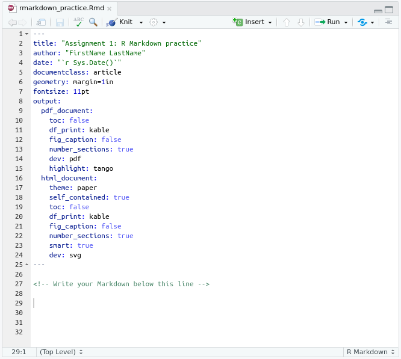
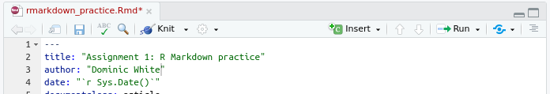
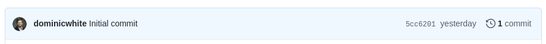

# Assignment 1: R Markdown practice

> ### Important
>
> Before you start working on this assignment you first need to set-up RStudio. If you have already worked through the first CDS 102 lab (Lab 0), then you do not need to do this again. Otherwise, please follow all the directions in this section of the supplementary textbook: [RStudio Initial Set-up](https://book.cds101.com/initial-set-up.html)

## Overview

The goal of this assignment is to recreate [this PDF file][rmarkdown-recreate-pdf].

## Instructions

1. Follow the instructions on Blackboard and [here](https://book.cds101.com/using-rstudio-server-to-clone-a-github-repo-as-a-new-project.html) to open this file in RStudio Server.

2. In the bottom right pane of RStudio is a *Files* tab. Once you have opened this assignment as a Project in RStudio, you will see a list of files here. Click on the file called `rmarkdown_practice.Rmd`. The file should open in a new editor pane in the top right of RStudio.

3. Take a look at the contents of the RMarkdown file. It should look something like this:

    
    
    To convert the RMarkdown file into an output PDF file, click the *Knit* button at the top of the editing pane. You should see a PDF appear, corresponding to the current contents of the `rmarkdown_practice.Rmd` file. 
  
    > Depending on your operating system/browser you may have to allow pop-ups, or click the PDF file that has appeared in the PDF pane.

4. Your goal for this assignment is to edit the contents of the `rmarkdown_practice.Rmd` file in RStudio so that when you Knit it to a PDF, it matches the contents and formatting of this example file (except for the diagonal watermark, the name, and the date): [`rmarkdown_example.pdf`][rmarkdown-recreate-pdf]. 

    Let's start by fixing the name. This is inserted into the PDF based on the author specified in the header section of the Rmd file (the header section contains formatting instructions, and is between the `---` on lines 1-25).
  
    Find the `author` line in the header section, and replace `FirstName LastName` with your first and last name. Keep the quotation marks.
  
    As soon as you edit the file, you will notice that the name of the file at the top editor tab for this `rmarkdown_practice.Rmd` has changed color: it should now be red with an asterisk after it:
  
    
  
    This indicates that the file is unsaved. Click the save icon at the top of the editor pane (or press Ctrl+S [Cmd+S on a Mac]). The file name should become black, indicating your work has been saved.
  
    Now Knit the file again. You should see that the resulting PDF has been updated to contain your name.

5. As well as saving the file normally, we will also be using Git to create checkpoints in the history of our project as we work on it. The checkpoints allow us to easily track the history of edits in the project (much like "Track Changes" in a Word document). We can also share this history of checkpoints (and work collaboratively) by uploading our checkpoints & edits to a shared website like GitHub.

    Some useful terminology:
    
    * **Commit**: the name for the checkpoints that we make
    * **Staging**: staging a file means that you want to include any edits to it in the next commit.
    * **Pushing**: the process of uploading your work to GitHub.
    
    When you first created the repository, there was a table of files near the top of the page. At the top of this table was a highlighted blue line that looked like this:
  
    
  
    If you look on the homepage for your repository on GitHub you should see something similar (The URL of this respository will be something like: `https://github.com/mason-sp21-cds101/assignment-1-yourGithubUsername`). This line tells you about the most recent commit (checkpoint) that was pushed (uploaded) to GitHub for this project. Right now there is just one commit, which is attributed to one of the CDS 101 professors.
    
    Let's add the change you just made to the project history! Follow [these instructions in the supplementary textbook](https://book.cds101.com/how-to-stage-commit-and-push-to-github-using-rstudio-server.html) to stage, commit, and push your work in the `rmarkdown_practice.Rmd` file to GitHub. (When you get to the commit message in Step 3, type something descriptive about the work you did, such as *Changed author name*.)
  
    Once you have successfully pushed your work, go back to the web page for your the GitHub repository for Assignment 1. Refresh the page. 
    
    * You should see that the blue header of information has updated - it should now say that there are two commits, and show that the most recent one was just created by you, along with the commit message that you created and the time of the commit!
    * If you look down the list of files below the blue header, you can also see that GitHub shows you the last commit that modified that file.
    
    > If you do not see this line change, you may need to "force" refresh the webpage: [instructions for different OS/browsers](https://www.wikihow.com/Force-Refresh-in-Your-Internet-Browser).
    >
    > If that still doesn't work, make sure that you committed and pushed the `rmarkdown_practice.Rmd` file correctly, without any error messages.

6. Let's get back to reproducing the [example file][rmarkdown-recreate-pdf] in RStudio. However, keep in mind that it's a good idea to commit your work frequently. You can push after each commit or after several commits, but bear in mind that pushing to GitHub is a good way of backing up your work.

    The date in the output PDF is automatically set to the current date by date line in the RMarkdown header (line 4), so we do not need to change that. Let's move onto the content of the file.
    
    Scroll down to line 28 and type a word or two here, e.g. *Hello World!*.
    
    Then Knit to PDF again - you should see that the text you just added appears in the PDF.
  
7. We can use special symbols to control how this text is formatted. For example, to convert this line to a heading, put `#` at the start of the line. I.e. replace `Hello World!` on line 8 with `# Hello World`.

    Knit again - you should see that the `#` is not in the PDF, but the line has been converted into a large heading, and automatically numbered for us.
    
    Try replacing `#` with `##` in the RMarkdown file - what happens?
    
    Now go back to the example PDF that we are trying to reproduce, and fill in the correct heading. 
    
    Knit and proofread the PDF until you've got that first heading correct. Then commit and push the `rmarkdown_practice.Rmd` file to GitHub. (Use a short but descriptive commit message for the work that you did, such as *Added first heading*). You should now see that you have 3 commits in your GitHub repository!

8. A guide to all the different formatting symbols you can use in an RMarkdown document is given in this PDF: [`RMarkdown reference guide`][rmarkdown-reference]

    Enter the text you see in the example PDF into the `rmarkdown_practice.Rmd` file, and then find the formatting symbols you need to match the formatting to the example PDF.
  
    Other instructions:
    
    * Make sure to replace the location of the class with the actual room that your section of CDS 101 is held in. If you are in an online section, you can put **Online** instead of a room.
    
    * The final part of the document is an *R code chunk*. This runs the code in the chunk and automatically inserts the output of the code below the chunk when you knit the file. Look up the opening and closing formatting symbols for a code chunk in the [`RMarkdown reference guide`][rmarkdown-reference] PDF.
    
    * Make sure you put blank lines between different paragraphs/headings/lists/etc. Text on consecutive lines will be treated as the same line when RStudio knits your file. For example:
      
      ```md
      Some regular text.
      # An Important Heading
      ```
      
      would be knitted to:
      
      Some regular text.# An Important Heading
      
      which is probably not what you intended...
    
    * Make sure you don't have spaces at the start of lines unless you intended to. Spaces at the start of lines are actually formatting symbols, so this can make your output look different to what you intended.
    
    * Commit at frequent intervals - we want to see at least 5 or 6 commits on GitHub by the time you are finished with the assignment.

When you're finished, follow the directions in the **[How to submit](#how-to-submit)** section below.


## How to submit

To submit your assignment, follow the two steps below.
Your assignment will be graded for credit **after** you've completed both steps!

1.  Save, commit, and push your completed R Markdown file so that everything is synchronized to GitHub.
    If you do this right, then you will be able to view your completed file on the GitHub website.

2.  Knit your R Markdown document to the PDF format, export (download) the PDF file from RStudio Server, and then upload it to the *Assignment 1* posting on Blackboard.

## Cheatsheets

You should keep the following reference handy while working on this assignment:

*   [RMarkdown reference][rmarkdown-reference]

[rmarkdown-reference]:     https://www.rstudio.com/wp-content/uploads/2015/03/rmarkdown-reference.pdf
[rmarkdown-recreate-pdf]:  https://drive.google.com/file/d/1mNQ9dD7Anallf0OTiUZ2mCrjxOUpasBr/view?usp=sharing

